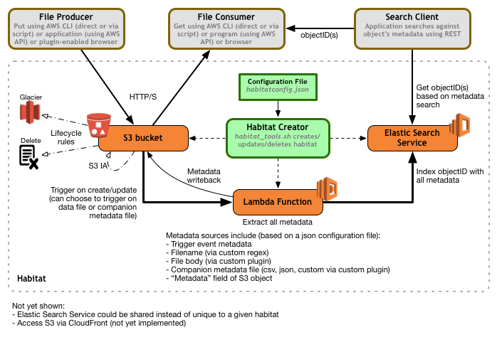

# Habitat - Where files live

**Habitat** is a simple and yet powerful self-contained object storage management system.
Based on Amazon Web Services, it is capable of virtually unlimited storage.
Instead of a large centralized management system, **Habitat** can be used as a local repository
for a single application or it can be shared and used with many clients.

**Habitat** is best used for situations where the client producers and consumers of the files
do not require a file system protocol interface and can use http(s) to access the store.

## Key features
* Upload/download via http(s) from any client that can issue HTTP POST requests
* Upload/download via any tools that support writing/reading from S3. For example:
  * Web browser (via a Java applet http://docs.aws.amazon.com/AmazonS3/latest/UG/enhanced-uploader.htm) 
  * Windows client: http://s3browser.com
  * Windows client: http://www.cloudberrylab.com/free-amazon-s3-explorer-cloudfront-IAM.aspx#close
  * Future: Web browser: we are building a web client that we will likely open source
* Future: upload via file interface where a file is stored by dropping in a temp directory
* Future: checkout a collection of files into a local file system (setting user/group permissions as desired)
* Immutable reference key for each stored file
* Stores metadata about the object from a variety of sources:
  * Parsed from the file name (customized parsing via a regular expression)
  * Extracted from the file contents (via a custom plugin)
  * Exracted from a companion metadata file (uploaded either before or after the data file)
  * Extracted from the write action event itself
  * Extracted from the S3 metadata attribute on the object
* Life cycle management to reduce to lower cost storage or to delete after defined time periods
* Get file or file list based on metadata search
* Search index using a discrete or shared Elastic Search instance
* Future: Supports object versioning
* Easily customized to tailor to unique requirements (config file driven, with custom plugins)
* Supports saving a shadow copy of metadata into the S3 object metadata in addition to the Elastic Search index

## Non-features
* Does not natively support collections at this time (*_TODO KLR_*: will prefixing just solve this with no work?)

## Installation

``` Shell
# Clone the repo to a local directory and cd to that directory

$ pip install awscli
$ pip install boto3
$ pip install elasticsearch -t .
$ pip install requests_aws4auth -t .

$ cp habitatconfig_sample.json habitatconfig.json
# Edit habitatconfig.json as needed.
# See Configuration section below for details on the format, but the key values change are:
  # awsAccountId
  # region
  # esDomain
  # bucket (must be globally unique across all of AWS)
  # No need to edit esEndpoint - this will be automatically updated

$ cp secret_sample.py secret.py
# Edit secret.py as appropriate

# Make sure that your AWS credentials are set up so that AWS CLI commands will work
$ ./habitat_tools.sh createesdomain # Creates your Elasticsearch Service domain
# Wait about 10-15 minutes for the domain to be created and usable.
# If you kill this before this finishes you'll need to run the following later when the domain creation is completed:
$ python -m esutils putEndpointInConfigFile

$ ./habitat_tools.sh createcode  # Creates and uploads the AWS Lambda function
$ ./habitat_tools.sh createbucket # Creates and initializes the S3 bucket

# Drops a test file into the S3 bucket and runs an Elastic Search query to verify that it's metadata was properly indexed.
$ ./habitat_tools.sh testdata
```

## Theory of Operation
A JSON file provides the configuration for a new repository.
An initialization script (`habitat_tools.sh`) makes AWS CLI commands to create and configure the various AWS resources that are used for the new repository.
The creation script also uploads a test file to verify the configuration was successful

A file (and optionally a companion metadata file) are uploaded to an S3 bucket using standard methods avialable for S3 (HTTP/S POST, or browser upload). 

The S3 bucket is configured to execute a defined Lambda function each time a new S3 object is posted. Since S3 is highly parallized and Lambda functions are executed in parallel, the throughput for storing new objects is really only limited by the clients and bandwith to AWS.

When the Lambda function executes it extracts the metadata from the object and optionally the companion meteadata file.
A regex is available in the configuration to determine how (or if) to extract metadata from the file name.
If metadata needs to be extracted from the file itself, then a user supplied function is called to return a list of key/value
pairs.
If a companion metadata file is used, it provides a set of key/value pairs in either a CSV, JSON, or custom format.
If a custom format is required, then a user-define function may be provided to parse the file and return the metadata.

Once the metadata is determined it is inserted into an Elastic Search domain along with the key for the stored object.
This information could also be stored in a database (e.g., DynamoDB), but at this point in time it's not clear that there is any incremental value beyond what Elastic Search offers.

A client can search Elastic Search based on metadata and then get a URL to use to fetch the file.
It is of course possible to create simple wrappers to return a file based on search criteria in a single step.



## Configuration
All configiration is stored in the file `habitatconfig.json`.
File is in JSON format.
Assume that all keys are required. Comment annotation is of course not valid JSON and part of this doc only.

``` JSON
{
    "awsAccountId": "<AWS account number>",
    "region": "<AWS region such as us-east-1",
    "bucket": "<Name of S3 bucket for this habitat>",
    "esDomain": "<ElasticSearch domain name. Must be 28 characters or less. May be dedicated or shared.>",

    "esEndpoint": "<hostname for ElasticSearch endpoint. Dynamically added to config file from habitat_tools.sh>",
    "esHabitatIndex": "<ElasticSearch index in which to store all habitat metadata>",
    "esDocType": "<ElasticSearch document type to associate with this habitat>",

    # Set either of the next two attributes to an empty string or omit to disable. 
    "dataFilenameRegex": "<Python style regular expression to parse file name for metadata>",
    "dataBodyParserModule": "<Name of Python module containing the function to parse the body for metadata>",
    # May set to 0 or omit maxBytes to disable body parsing
    "dataBodyParserMaxBytes": <Max number of bytes to read when parsing body for metadata>,

    # Normally leave at true. Unless s3head object metadata is really not needed and performance needs to be optimized.
    "inspectS3head": true | false,
    # Use the metadata field on the S3 object as a source for metadata. inspectS3head must be true to get S3 Metadata
    "getMetadataFromObject": true | false,

    # Set any of the following three attributes to 0 to disable the corresponding tier transition
    "daysBeforeIA": <Number of days after create that object will drop to S3 IA storage>,
    "daysBeforeGlacier": <Number of days after create that object will drop to Glacier storage>,
    "daysBeforeExpire": <Number of days after create that object will be deleted>,

    # written_first means that the metadata file is written first (with a meta/ prefix) and then the data
    # file is written (data/ prefix). The data file triggers the indexing process.
    # written_last means that the metadata file is written last (with a meta/ prefix) and then the data
    # file is written (data/ prefix). The metadata file triggers the indexing process.
    "metafileMode": "disable" | "written_first" | "written_last",
    "metafileFormat": "json" | "csv" | "custom",
    "metafileParserModule": "<Name of Python module containing the function to parse the metadata file>",

    # These are not yet implemented...
    "useCrossRegionReplication": true,
    "useVersioning": true,
    "attachMetadataToObject": true,
}
```

## License
   Copyright 2016 Novartis Institutes for BioMedical Research

   Licensed under the Apache License, Version 2.0 (the "License");
   you may not use this file except in compliance with the License.
   You may obtain a copy of the License at

       http://www.apache.org/licenses/LICENSE-2.0

   Unless required by applicable law or agreed to in writing, software
   distributed under the License is distributed on an "AS IS" BASIS,
   WITHOUT WARRANTIES OR CONDITIONS OF ANY KIND, either express or implied.
   See the License for the specific language governing permissions and
   limitations under the License.

## TODO
### Hot

### Lower priority
- [ ] Search code for all 'KLR' and 'TODO' references
- [ ] Look for remaining hard codings, especially on policies
- [ ] How set up ES policy to allow Kibana?
- [ ] How set up ES policy and esutils.py so that I can use a role to access ES instead of saving keys in the uploaded secret.py file?
- [ ] Set up a handler for delete actions and remove index?
- [ ] Handle errors and put them in a curation queue

